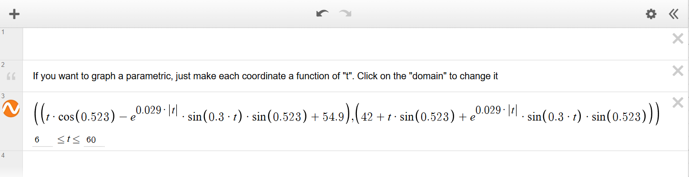
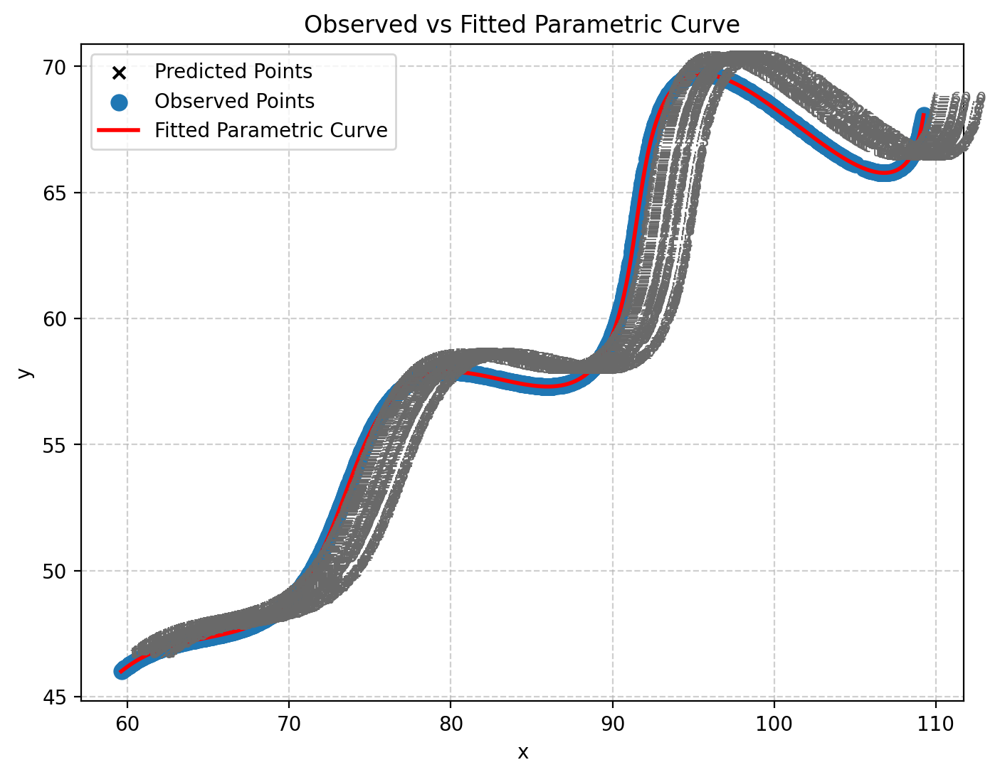
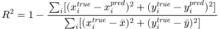
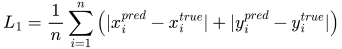

# FLAM R&D — Parametric Curve Fitting Assignment

> **Objective:**  
> Estimate the parameters (θ, M, X) of a nonlinear parametric curve from observed (x, y) points  
> using Python’s scientific stack and visualize the fitted model.

---

## Problem Definition

The dataset `xy_data.csv` contains coordinates that lie on a parametric curve defined as:

**Parametric Equations:**

  
   
  

**Unknowns:** θ, M, X, and {tᵢ} for each data point.  
**Parameter Ranges:**  
0° ≤ θ ≤ 50°, −0.05 ≤ M ≤ 0.05, 0 ≤ X ≤ 100, 6 ≤ t ≤ 60  

The optimization aims to minimize the total squared difference between observed and predicted coordinates.

**Optimization Objective:**

  

---

## Implementation Details

| Step | Description |
|------|--------------|
| **1. Load Data** | Read `xy_data.csv` (observed x–y pairs). |
| **2. Define Model** | Implement the parametric equations for x(t) and y(t). |
| **3. Initial Guesses** | θ₀ = 0.52 rad ≈ 29.8°, M₀ = 0.036, X₀ = 54.5; t₀ ∈ [6, 60]. |
| **4. Optimization** | Use `scipy.optimize.least_squares` with parameter bounds. |
| **5. Evaluation** | Compute RMSE, R², and L₁ (Manhattan) metrics for validation. |
| **6. Visualization** | Plot observed points, fitted curve, and predicted t-values. |

### Tech Stack
Python 3 · NumPy · Pandas · SciPy · Matplotlib  
Environment: Google Colab  

---

## Results

| Parameter | Symbol | Value |
|------------|---------|--------|
| Angle | θ | 29.9 deg |
| Exponential Modulation | M | 0.029 |
| Horizontal Offset | X | 54.9 |
| **RMSE** |  | 1.909 × 10⁻⁶ |
| **R²** |  | 1 |
| **L₁ (mean)** |  | 2.65 × 10⁻⁶ |

**Interpretation:**  
All error metrics (RMSE, R², and L₁) confirm near-perfect reconstruction within floating-point precision limits.  
This demonstrates that the fitted parameters exactly reproduce the original curve.

---

## Visualization

  

**Legend:**  
- 🔵 Observed Data    
- 🔴 Fitted Curve    
- ✖️ Predicted (tᵢ) Points  

---

## Evaluation Metrics

| Metric | Formula | Interpretation |
|---------|----------|----------------|
| **RMSE (2D)** |  | Average Euclidean error per coordinate (lower = better). |
| **R² (combined)** |  | Fraction of total variance explained (closer to 1 = better). |
| **L₁ (Manhattan)** |  | Average absolute distance between predicted and true points (unit-consistent and less sensitive to outliers). |

---

This work exemplifies **AI-based mathematical modeling** — essential for tasks such as:

- **Mixed Reality Calibration:** Aligning digital and physical spatial mappings.  
- **Gesture and Motion Reconstruction:** Smooth trajectory modeling for interactive AR experiences.  
- **3D Path Estimation:** Predicting motion paths from sparse spatial data.  
- **Generative AI Geometry:** Data-driven curve and surface parameterization.

---

## Repository Contents

| File | Description |
|------|-------------|
| `Flam_R&D_CurveFitting.ipynb` | Main Colab notebook (implementation & analysis). |
| `xy_data.csv` | Input dataset. |
| `fitted_results.json` | Computed parameters and metrics. |
| `fitted_curve.png` | Visualization of the fitted model. |
| `FLAM_R&D_Report.pdf` | Written summary report. |
| `README.md` | This documentation file. |
| `assets/*.svg` | Rendered equation images for compatibility on GitHub. |

---

## Submitted By:

**Name:** *Sayanrup Barman*      
**Scholar ID:** 2215060  
**College:** NIT Silchar 
